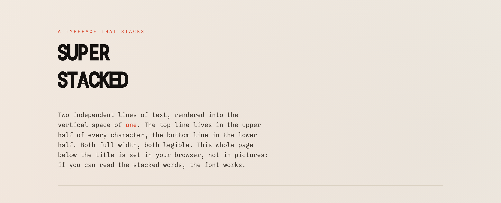
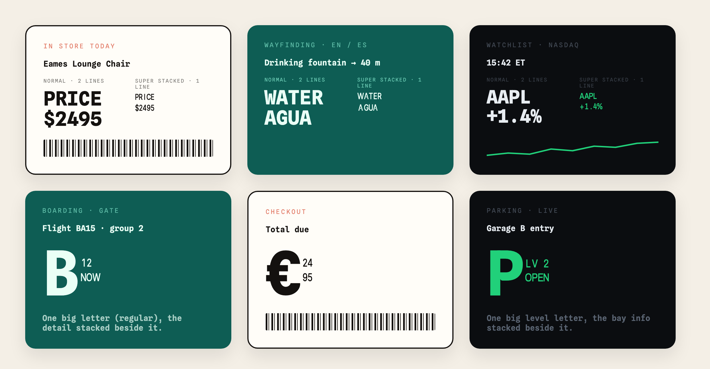
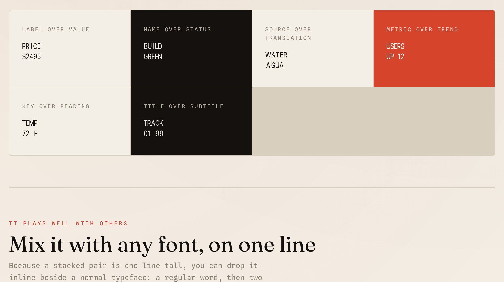
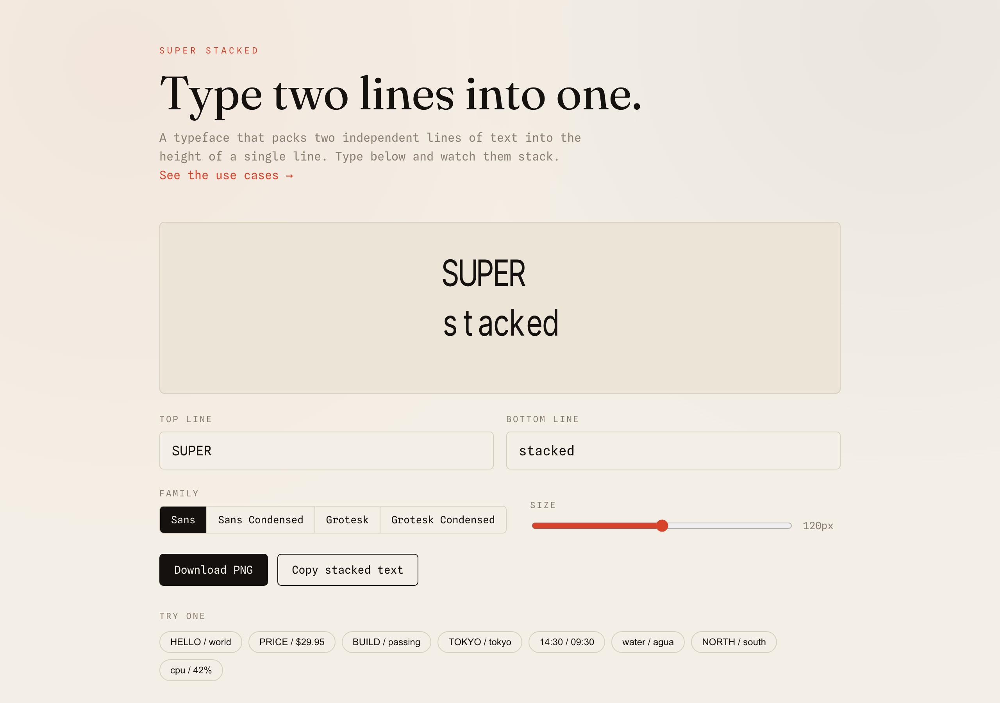
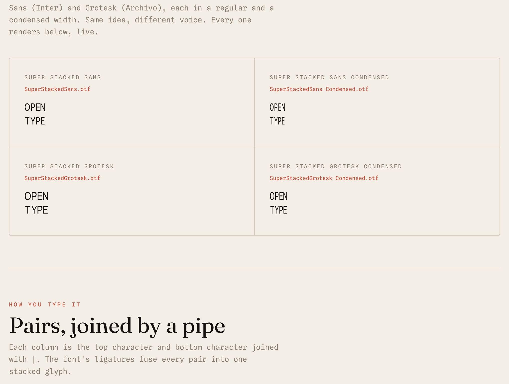
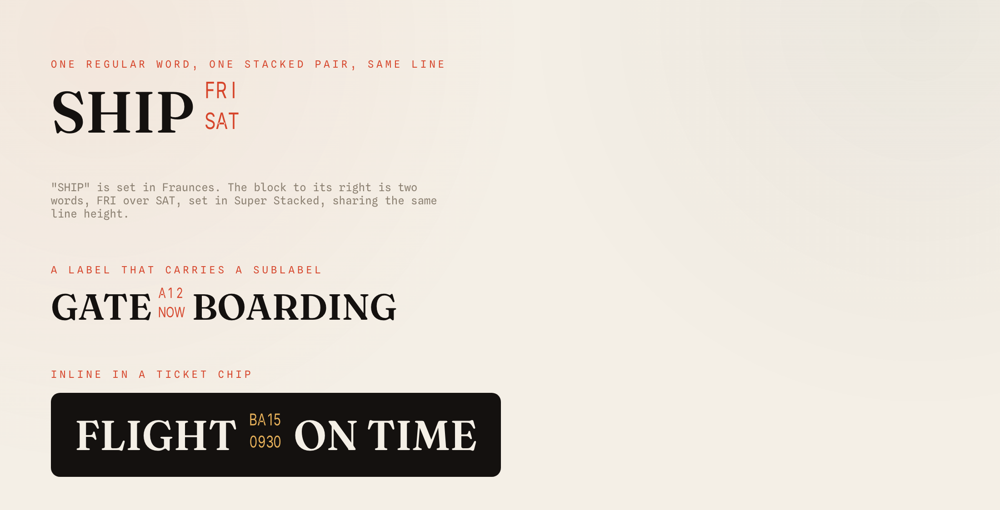

<div align="center">

# ▄▀ Super Stacked

### Two lines of text in one line's height.



**A typeface that stacks two independent lines of text into the vertical space of one.**
Both characters full width, both equally legible. The top line lives in the upper half of
every character cell, the bottom line in the lower half. Twice the text, same height.

<br>



<sub>Top row: the same two words set normally (two lines, tall) next to Super Stacked (one line, half the height). Bottom row: a single big regular-font character on the same baseline as a stacked pair (gate B + 12/NOW, euro sign + 24/95, level P + LV 2/OPEN). ([build them yourself](out/widgets.html))</sub>

<br>

[**Playground**](out/index.html) &nbsp;·&nbsp; [**Showcase**](out/showcase.html) &nbsp;·&nbsp; [**Download fonts**](out/) &nbsp;·&nbsp; [**License**](OFL.txt) &nbsp;·&nbsp; [**Changelog**](CHANGELOG.md)


</div>

---

## The thirty-second version

You have a label and a value. A name and a status. A word and its translation. Normally
that costs you two lines. Super Stacked welds them into one stacked glyph per column, so
the whole thing reads cleanly in a single line of height:

```
type:  H|WE|OL|RL|LO|D          renders:  ▛▌ stacked HELLO over WORLD in one line ▐▟
```

It ships as **four real OpenType fonts** you install and type with anywhere ligatures
render: browsers, Figma, Photoshop, InDesign, Word. Two styles, two widths, one idea.

## Where it earns its keep

Dashboards, status lines, transit boards, tickets, tiny screens: everywhere starved of
vertical space. A normal font packs text horizontally, one line per line. Super Stacked
packs a second stream into the same row. A few of the shapes it fits:

| Pattern | Top line | Bottom line | Where you would use it |
|---------|----------|-------------|------------------------|
| Label over value | `PRICE` | `$2495` | price tags, spec sheets, product cards |
| Name over status | `BUILD` | `GREEN` | CI dashboards, service health, deploy boards |
| Source over translation | `WATER` | `AGUA` | bilingual signage, language apps, menus |
| Metric over trend | `USERS` | `UP 12` | KPI tiles, analytics, scoreboards |
| Key over reading | `TEMP` | `72 F` | sensor readouts, weather, instrument panels |
| Title over subtitle | `TRACK` | `01 99` | music players, playlists, track listings |
| Code over gate | `BA15` | `0930` | departure boards, tickets, schedules |
| Day over slot | `FRI` | `SAT` | calendars, booking grids, shift planners |
| Field over entry | `NAME` | `ADA L` | dense forms, badges, directory rows |
| Ticker over move | `AAPL` | `+1.4%` | finance tickers, watchlists, trading UIs |

Each row is one line of height instead of two. Here they are rendered in the font:



> All of these are just `superstacked.js`: `ss.encode("PRICE", "$2495")`, drop the result
> into any element set in the font. See [Using it](#using-it) below.

## Try it now, no install

Open the **interactive playground**, type your own two lines, switch family, resize, then
download a PNG or copy the stacked text:

```bash
cd out && python3 -m http.server 8000
# open http://localhost:8000/index.html
```

(Or just double-click [`out/index.html`](out/index.html): it works straight from disk too.)



## The four families

Two styles, two widths. Sans is built from **Inter**, Grotesk from **Archivo**, each in a
regular and a condensed cut. Same idea, different voice.



| Font file | Base | Width |
|-----------|------|-------|
| [`SuperStackedSans.otf`](out/SuperStackedSans.otf) | Inter (geometric sans) | regular |
| [`SuperStackedSans-Condensed.otf`](out/SuperStackedSans-Condensed.otf) | Inter | condensed |
| [`SuperStackedGrotesk.otf`](out/SuperStackedGrotesk.otf) | Archivo (grotesque) | regular |
| [`SuperStackedGrotesk-Condensed.otf`](out/SuperStackedGrotesk-Condensed.otf) | Archivo | condensed |

---

# Using it

## 1. In a design app (the font + pipe ligatures)

1. Download an `.otf` from [`out/`](out/) and install it (double-click, then Install).
2. Turn on ligatures in your app (standard or discretionary).
3. Type each column as `TOP|BOTTOM`, joined by a pipe, **no spaces between columns.**
   The font fuses each `X|Y` into one stacked glyph.

To write **HELLO** over **WORLD**, type `H|WE|OL|RL|LO|D`. The font owns the spacing, so
do not add spaces between the pairs. Unequal lengths are fine: the shorter line stacks
over empty space (so `WATER` over `AGUA` puts the final `R` over a blank).

## 2. On the web (direct, no ligatures needed)

Browsers refuse to ligate pairs containing a space, so on the web each stacked pair has
its own Private-Use codepoint and you address it directly. [`out/superstacked.js`](out/superstacked.js)
does the encoding; it is about forty lines with no dependencies.

```html
<link rel="preconnect" href="https://fonts.gstatic.com">
<style>
  @font-face {
    font-family: "Super Stacked";
    src: url("SuperStackedSans.otf") format("opentype");
  }
  .stacked {
    font-family: "Super Stacked";
    line-height: 1;          /* a stacked glyph is exactly one line tall */
    white-space: nowrap;
  }
</style>

<span class="stacked" id="label"></span>

<script src="superstacked.js"></script>
<script>
  SuperStacked.load("font_data.json").then((ss) => {
    document.getElementById("label").textContent = ss.encode("HELLO", "WORLD");
  });
</script>
```

That is the whole integration. `encode(top, bottom)` returns one character per column;
drop it into any element set in the font. (`load()` fetches `font_data.json`, so serve
the page over HTTP; to run from `file://`, inline the data with `SuperStacked.build({...})`
instead, as the bundled playground does.)

## 3. Mixed with a normal font, on one line ✨

This is the trick that makes it sing. Because a stacked pair is exactly one line tall, you
can drop it **inline next to a regular typeface**: a normal word, then two stacked words
right beside it, sharing the same baseline. One word next to two.



The recipe is a flex container that vertically centers both faces:

```html
<style>
  .mix       { display: inline-flex; align-items: center; gap: .2em; line-height: 1; }
  .mix .word { font-family: "Fraunces", serif; font-weight: 600; }   /* any normal font */
  .mix .ss   { font-family: "Super Stacked"; line-height: 1; color: #d6452b; }
</style>

<span class="mix" style="font-size:48px">
  <span class="word">SHIP</span>
  <span class="ss" id="when"></span>          <!-- FRI over SAT, stacked -->
  <span class="word">BY FRIDAY</span>
</span>

<script src="superstacked.js"></script>
<script>
  SuperStacked.load("font_data.json").then((ss) => {
    document.getElementById("when").textContent = ss.encode("FRI", "SAT");
  });
</script>
```

Renders as: **SHIP** `[FRI/SAT]` **BY FRIDAY**, all on one line, the stacked pair sitting
between two normal words at the same height. Perfect for departure boards, tickets,
scoreboards, or any label that wants to carry a sub-label without a second line.

See it live in [`out/mix-demo.html`](out/mix-demo.html).

## Character set

Uppercase `A-Z`, lowercase `a-z`, digits `0-9`, space, and punctuation
`. , : - % $ / ! ? ' # & + ( )`: 77 printable units, plus an invisible in-pair blank so a
character can stack over empty space. Every ordered pair stacks, so each family contains
**6,084 stacked-pair glyphs.** Characters outside the set are simply left unstacked.

---

## Build from source

A fresh clone rebuilds all four fonts, byte-for-byte reproducibly, with one command:

```bash
pip install -r requirements.txt   # pinned: fonttools, pytest
python3 -m superstack.build_font
# wrote out/SuperStackedSans.otf
# wrote out/SuperStackedSans-Condensed.otf
# wrote out/SuperStackedGrotesk.otf
# wrote out/SuperStackedGrotesk-Condensed.otf
```

This also regenerates `out/font_data.json`, the descriptor the web pages read. The build
pins the font timestamps (honoring `SOURCE_DATE_EPOCH`) so a clean rebuild is identical.

## How it works

- [`composer.py`](src/superstack/composer.py) takes a base font and, for any pair of
  characters, condenses each letter, squashes the top into the upper half of the em and
  the bottom into the lower half with a hairline gap, and aligns both to a common left
  edge. They keep full width, so they read as two clean letters, not accents.
- [`build_font.py`](src/superstack/build_font.py) runs the composer over the whole
  character set, names each glyph (`A_over_B`, `zero_over_one`, ...), builds the OpenType
  ligature table (`top | bottom` -> welded glyph) plus a direct Private-Use codepoint per
  pair for the web, embeds the full name and license metadata, and writes all four `.otf`
  files plus `font_data.json`.
- [`superstacked.js`](out/superstacked.js) is the matching web encoder: about forty
  dependency-free lines that turn two strings into one Private-Use character per column.

## Project layout

```
assets/base-fonts/    Inter and Archivo (OFL), the outlines we compose from
assets/screenshots/   README imagery
src/superstack/       composer, build_font (the generator)
out/                  built .otf fonts, font_data.json, superstacked.js, playground, showcase, mix-demo
tests/                pytest suite (composer, build, golden)
```

## Tests

```bash
python3 -m pytest
```

Checks the charset, glyph naming, the top/bottom split with a clean gap, that the build
emits a font with the expected glyphs and a round-tripping `font_data.json`, and that
PUA codepoints resolve in the cmap.

## Contributing

Issues and pull requests welcome. Please:

- Run `python3 -m pytest` before opening a PR; CI runs the same suite plus a full build.
- Keep the source-to-font path reproducible: every shipped `.otf` must rebuild from
  `python3 -m superstack.build_font`.
- Match the existing style. (House rule: no em or en dashes anywhere. Use commas, colons,
  or plain hyphens.)

## License

Super Stacked is released under the **SIL Open Font License, Version 1.1**, see
[`OFL.txt`](OFL.txt). The license and copyright are embedded in every `.otf` name table,
not just the text file.

The fonts compose their outlines from [Inter](https://github.com/rsms/inter) and
[Archivo](https://github.com/Omnibus-Type/Archivo), both under the OFL, so the generated
fonts inherit the same license. The Python tooling in this repo is yours to use freely.
